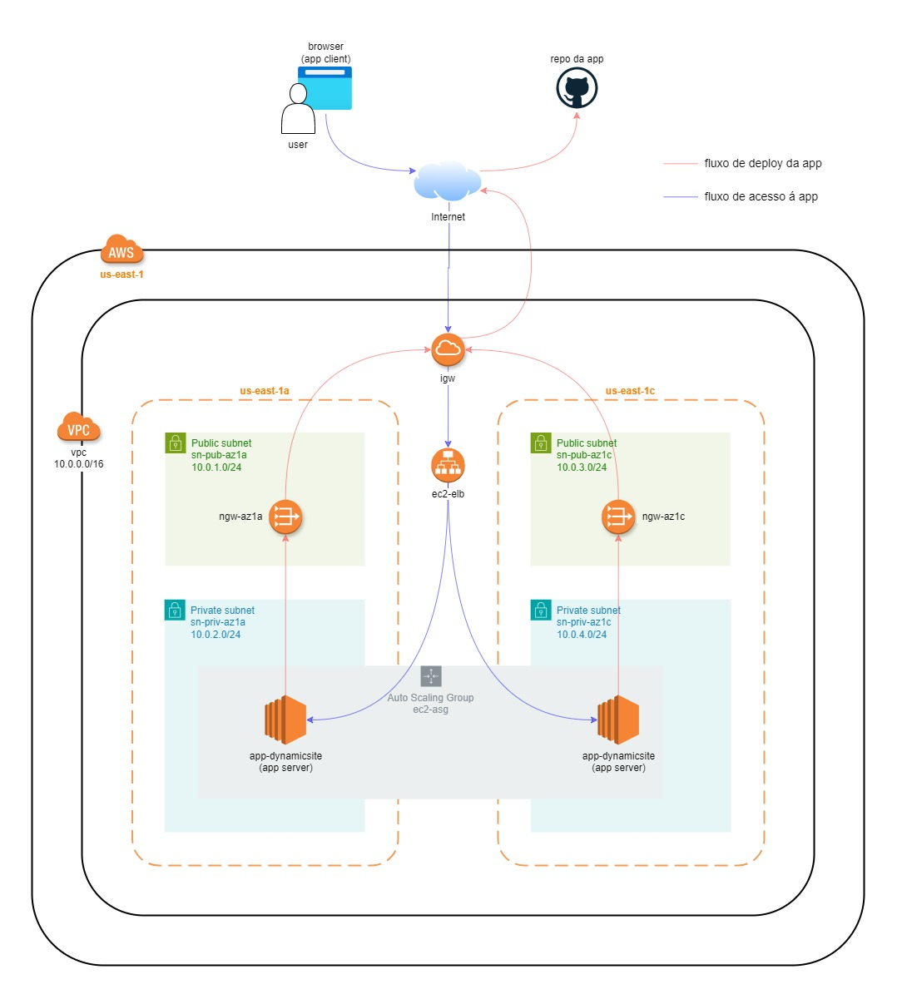
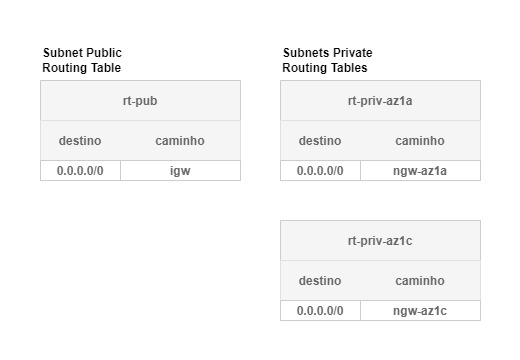
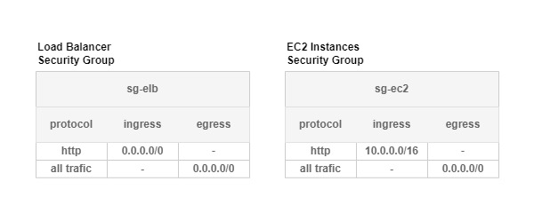

# AWS Auto Scaling Group

## Arquitetura

Aplicação [app-dynamicsite](https://github.com/kledsonhugo/app-dynamicsite) rodando em instâncias EC2 privadas e acessada externamente através de um Balanceador de Carga exposto publicamente.

As instâncias EC2 privadas conseguem via NAT acessar a Internet para instalação e atualização de pacotes (incluindoa a aplicação localizada em um repositório no GitHub), porém não são acessadas diretamente pela Internet. Não possuem IP público.

A solução contempla os seguintes serviços e recursos da AWS:

1. **VPC (Virtual Private Cloud)**: VPC com um bloco CIDR de 10.0.0.0/16.

2. **Internet Gateway**: Um Internet Gateway anexado à VPC.

3. **Subnets**: Quatro sub-redes dentro da VPC, duas públicas e duas privadas. As sub-redes públicas estão nas zonas de disponibilidade us-east-1a e us-east-1c, com blocos CIDR de 10.0.1.0/24 e 10.0.3.0/24, respectivamente. As sub-redes privadas também estão nas zonas de disponibilidade us-east-1a e us-east-1c, com blocos CIDR de 10.0.2.0/24 e 10.0.4.0/24, respectivamente.

4. **NAT Gateways**: Dois NAT Gateways, um para cada sub-rede pública. Cada NAT Gateway tem um EIP (Elastic IP) associado.

5. **Route Tables**: Três tabelas de roteamento. Uma para as sub-redes públicas, que tem uma rota para o Internet Gateway. As outras duas são para as sub-redes privadas, cada uma com uma rota para o respectivo NAT Gateway.

6. **Security Groups**: Dois grupos de segurança, um para um ELB (Elastic Load Balancer) e outro para instâncias EC2.

7. **Load Balancer**: Um Load Balancer do tipo aplicação, com um listener HTTP na porta 80.

8. **Target Group**: Um Target Group para o Load Balancer, também com protocolo HTTP e porta 80.

9. **Launch Template**: Um Launch Template para instâncias EC2, com uma imagem AMI específica, tipo de instância t2.micro, um script de inicialização e o grupo de segurança EC2.

10. **Auto Scaling Group**: Um Auto Scaling Group com o Launch Template, com capacidade desejada de 4 instâncias, mínimo de 2 e máximo de 8. Este ASG está associado ao Target Group do Load Balancer e usa as sub-redes privadas para lançar instâncias.

## Tabelas de roteamento

A solução contém três tabelas de roteamento:

**rt-pub**: Associada às duas sub-redes públicas. Contém uma rota direta para a Internet através do Internet Gateway, o que significa que os recursos dessa sub-rede podem acessar a internet diretamente.

**rt-priv-az1a**: Esta é a tabela de roteamento da sub-rede privada na Zona de Disponibilidade **1a**. Contém uma rota para a Internet através do NAT Gateway localizado na mesma Zona de Disponibilidade, o que significa que os recursos nessa sub-rede podem acessar a Internet apenas com um NAT, mas não podem ser acessados diretamente da internet.

**rt-priv-az1c**: Esta é a tabela de roteamento da sub-rede privada na Zona de Disponibilidade **1c**. Contém uma rota para a Internet através do NAT Gateway localizado na mesma Zona de Disponibilidade, o que significa que os recursos nessa sub-rede podem acessar a Internet apenas com um NAT, mas não podem ser acessados diretamente da internet.

> :warning: **Aviso:** Cada tabela de roteamento deve ser associada a sub-redes específicas através de associações de tabela de roteamento. Por exemplo, a tabela de roteamento rt-pub deve ser associada às sub-redes sn-pub-az1a e sn-pub-az1c. As tabelas de roteamento privadas rt-priv-az1a e rt-priv-az1c devem ser associadas às sub-redes sn-priv-az1a e sn-priv-az1c respectivamente.

Em resumo, as tabelas de roteamento definem como o tráfego de rede é direcionado. As tabelas de roteamento públicas permitem que os recursos acessem a internet diretamente, enquanto as tabelas de roteamento privadas permitem que os recursos acessem a internet através de um gateway NAT, protegendo-os de acesso direto da internet.

## Grupos de segurança

A solução define dois Security Groups:

**sg-elb**: Security Group para o Elastic Load Balancer (ELB). Ele permite todo o tráfego de saída (egress) e permite tráfego de entrada (ingress) na porta 80 (usada para tráfego HTTP) de qualquer endereço IP (0.0.0.0/0).

**sg-ec2**: Security Group para as instâncias EC2 criadas pelo Auto Scaling Group. Ele permite todo o tráfego de saída (egress) e permite todo o tráfego de entrada (ingress) apenas para endereços IP da própria VPC (10.0.0.0/16).

Detalhes de cada regra:

**egress**: Esta regra permite todo o tráfego de saída.
- **from_port = 0** e **to_port = 0**: significa que todas as portas estão abertas.
- **protocol = -1**: significa que todos os protocolos estão permitidos.
- **cidr_blocks = ["0.0.0.0/0"]**: significa que o tráfego pode ser destinado a qualquer endereço IP.

**ingress**: Esta regra permite o tráfego de entrada.
- No sg-elb, **from_port = 80** e **to_port = 80**: significa que apenas a porta 80 está aberta.
- **protocol = "tcp"**: significa que apenas o protocolo TCP está permitido.
- **cidr_blocks = ["0.0.0.0/0"]**: significa que o tráfego pode vir de qualquer endereço IP. 
- No sg-ec2, todas as portas e protocolos estão abertos, mas apenas para endereços IP na faixa 10.0.0.0/16.

Em resumo, os Security Groups atuam como um firewall no nível da instância, controlando o tráfego de entrada e saída para as instâncias EC2 e outros recursos na AWS. As regras de egress permitem que os recursos enviem tráfego para vários endereços IP, enquanto as regras de ingress controlam de onde esses recursos podem receber tráfego.
